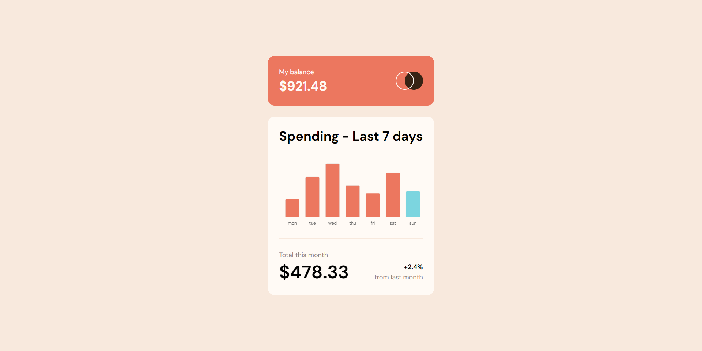

# Frontend Mentor - Expenses chart component solution

This is a solution to the [Expenses chart component challenge on Frontend Mentor](https://www.frontendmentor.io/challenges/expenses-chart-component-e7yJBUdjwt). Frontend Mentor challenges help you improve your coding skills by building realistic projects.

## Table of contents

- [Overview](#overview)
  - [The challenge](#the-challenge)
  - [Screenshot](#screenshot)
  - [Links](#links)
- [My process](#my-process)
  - [Built with](#built-with)
  - [What I learned](#what-i-learned)
  - [Continued development](#continued-development)
  - [Useful resources](#useful-resources)
- [Author](#author)
- [Acknowledgments](#acknowledgments)

## Overview

### The challenge

Users should be able to:

- View the bar chart and hover over the individual bars to see the correct amounts for each day
- See the current day’s bar highlighted in a different colour to the other bars
- View the optimal layout for the content depending on their device’s screen size
- See hover states for all interactive elements on the page
- **Bonus**: Use the JSON data file provided to dynamically size the bars on the chart

### Screenshot



### Links

- Solution URL: [Add solution URL here](https://github.com/Olixpin/expenses-chart-component-main)
- Live Site URL: [Add live site URL here](https://olixpin.github.io/expenses-chart-component-main/)

## My process

I started by creating a new project in GitHub and adding the following files:
index.html, style.css, script.js, images/screenshot.png, README.md, package.json, and LICENSE.md.

### Built with

- Semantic HTML5 markup
- CSS custom properties
- Flexbox
- CSS Grid
- Desktop-first workflow
- [chartjs.org](https://chartjs.org/) - JS library for creating charts

### What I learned

- I learned how to use the [chartjs.org](https://chartjs.org/) library to create a bar chart

```js
const myChart = new Chart(document.getElementById('myChart'), {
  type: 'bar',
  data: data,
  options: data.options,
});
```

### Continued development

Master the use of chartjs.org to create a bar chart.
Calculate the total amount spent for each day.

### Useful resources

- [chart.js](chartjs.org) - This is a JS library that helps me to crate amazing bar charts.
- [Traversy](https://www.youtube.com/watch?v=sE08f4iuOhAhttps://www.example.com) - This help me to get started with chart.js

## Author

- Frontend Mentor - [@olixpin](https://www.frontendmentor.io/profile/olixpin)
- Twitter - [@olixpin](https://www.twitter.com/olixpin)

## Acknowledgments

I want to use this opportunity to thank [Frontend Mentor](https://www.frontendmentor.io/) for their support and guidance. I also want to thank [Traversy](https://www.youtube.com/watch?v=sE08f4iuOhA) for helping me to get started with chart.js.
I also want to thank [chartjs.org](https://chartjs.org/) for creating a framework that makes it easier to create charts.
